<div align="center">

# Отчет

</div>

<div align="center">

## Практическая работа №12

</div>

<div align="center">

## Типы активностей. Шаблоны Android Studio. Сохранение настроек с SharedPreferences

</div>

**Выполнил:**  
Покидов Матвей Юрьевич

**Курс:** 2

**Группа:** ИНС-б-о-24-1

**Направление:** 09.03.02

**Профиль:** Информационные системы и технологии

**Проверил:**  

Потапов Иван Романович

---

### Цель работы

Изучить различные типы шаблонов активностей, предоставляемых Android Studio. Научиться создавать многоэкранные приложения с использованием разных видов окон. Освоить механизм сохранения простых пользовательских настроек с помощью `SharedPreferences`.

### Задания для самостоятельного выполнения

**Вариант 11: Волк ловит яйца**

### Ход работы

#### 1. Настройка проекта и манифеста

Был создан проект `WolfCatchEggs`. В файл `AndroidManifest.xml` добавлены разрешения `INTERNET` и `VIBRATE`.

<div align="center">

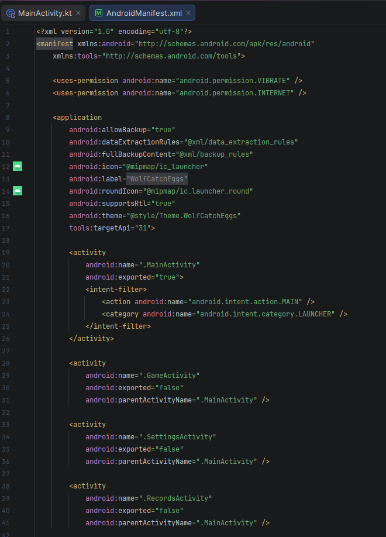

**Рисунок 1** — Содержимое AndroidManifest.xml с разрешениями и активностями

</div>

#### 2. Создание главного экрана (MainActivity)

Главный экран содержит приветственный баннер с изображением волка, блок текущих настроек и кнопки навигации.

<div align="center">

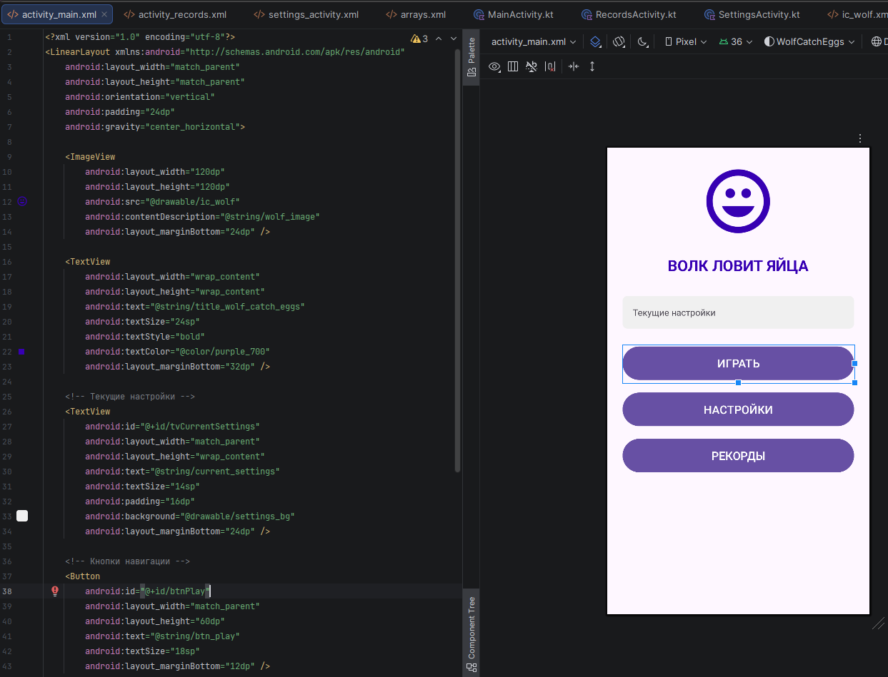

**Рисунок 2** — XML-разметка главного экрана (activity_main.xml)

</div>

<div align="center">

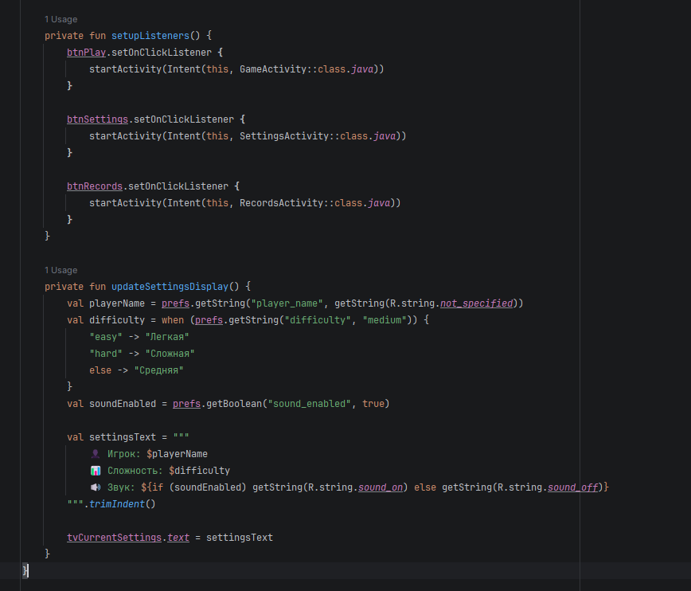

**Рисунок 3** — Код MainActivity.kt: обработчики кнопок и метод обновления настроек

</div>

<div align="center">

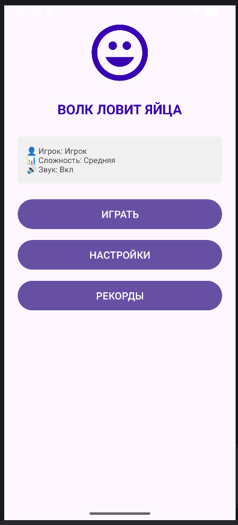

**Рисунок 4** — Главный экран с загруженными настройками

</div>

#### 3. Создание экрана настроек (SettingsActivity)

Для создания настроек использован шаблон **Settings Activity**. Все элементы описаны в XML-файле и автоматически сохраняются в `SharedPreferences`.

<div align="center">

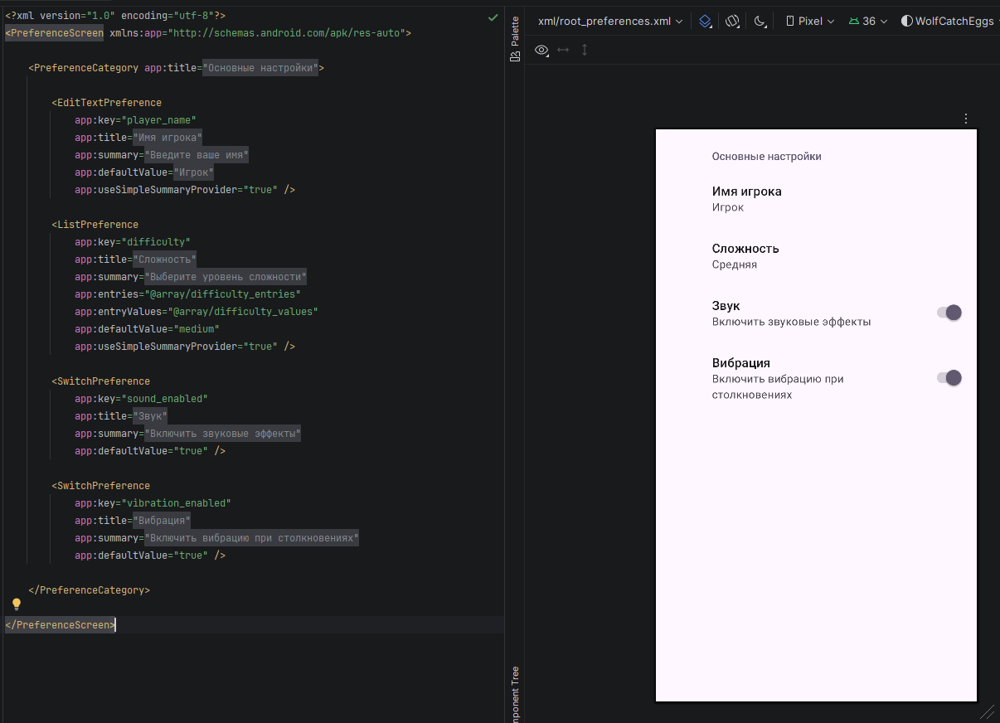

**Рисунок 5** — Файл root_preferences.xml с описанием параметров

</div>

<div align="center">

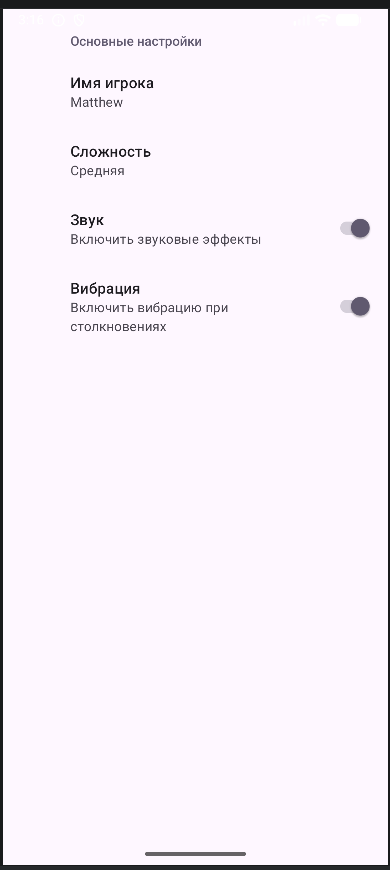

**Рисунок 6** — Интерфейс экрана настроек

</div>

#### 4. Создание экрана игры (GameActivity)

Экран игры имитирует процесс ловли яиц. Реализована логика подсчёта очков, учёт сложности, вибрация при событиях и сохранение рекорда.

<div align="center">

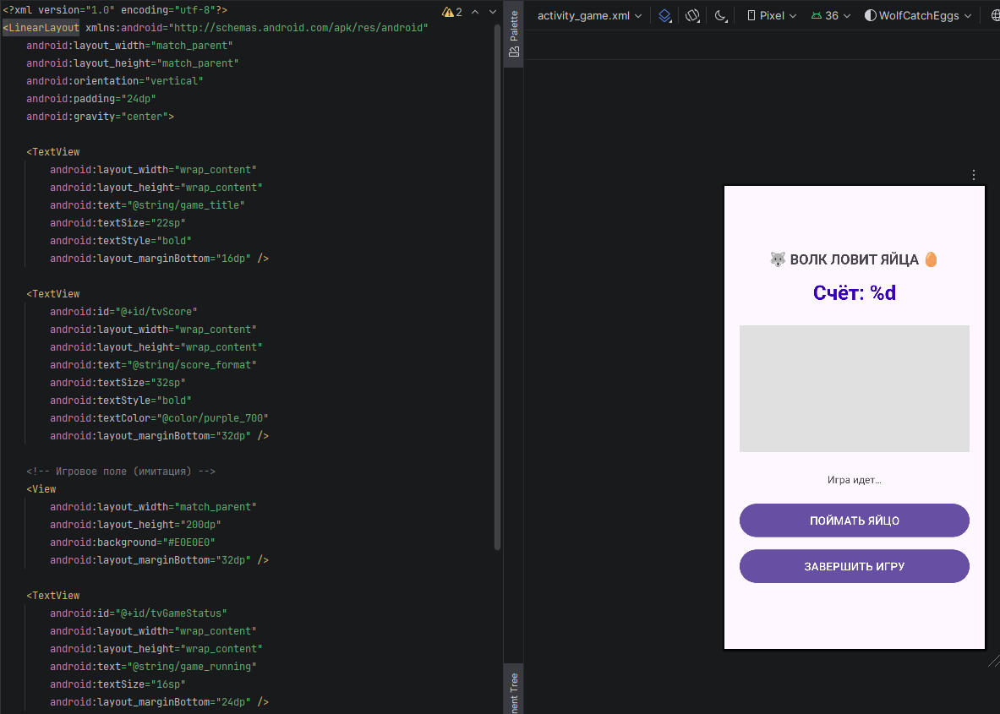

**Рисунок 7** — XML-разметка игрового экрана (activity_game.xml)

</div>

<div align="center">

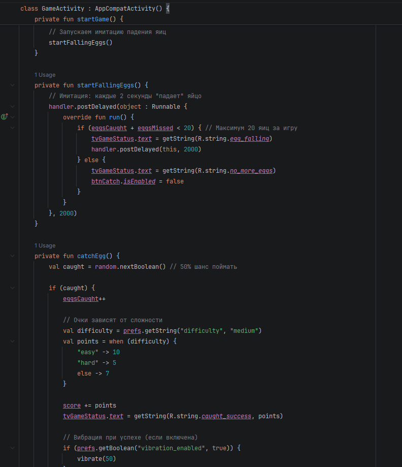

**Рисунок 8** — Код GameActivity.kt: имитация падения яиц и метод catchEgg()

</div>

<div align="center">

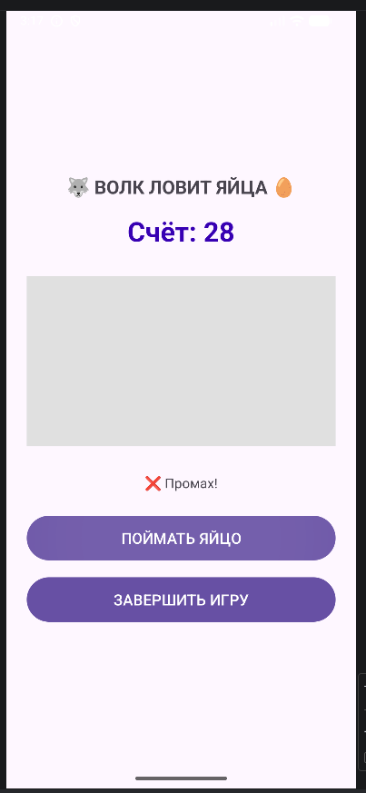

**Рисунок 9** — Игровой процесс: яйцо падает, игрок готовится ловить

</div>

<div align="center">

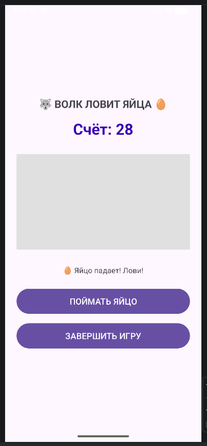

**Рисунок 10** — Игровой процесс: промах, счёт не увеличился

</div>

#### 5. Создание экрана рекордов (RecordsActivity)

Экран рекордов отображает лучший результат, имя рекордсмена и общую статистику игр.

<div align="center">

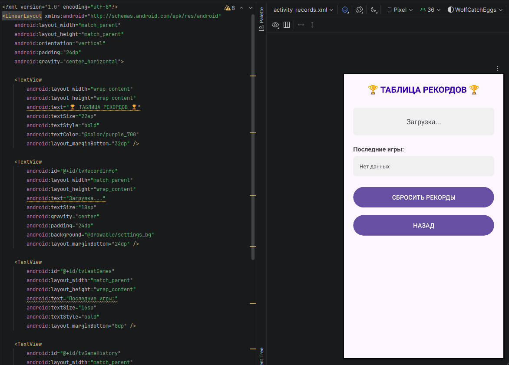

**Рисунок 11** — XML-разметка экрана рекордов (activity_records.xml)

</div>

<div align="center">

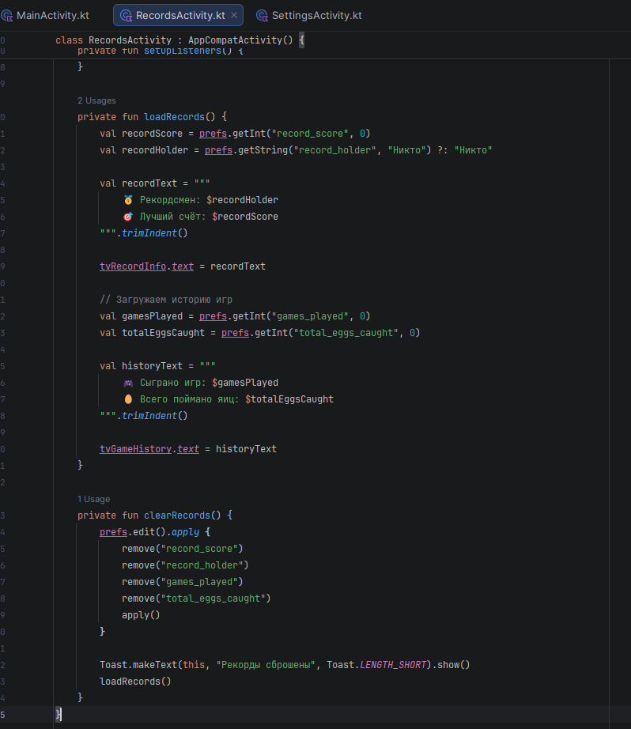

**Рисунок 12** — Код RecordsActivity.kt: загрузка и отображение статистики

</div>

<div align="center">

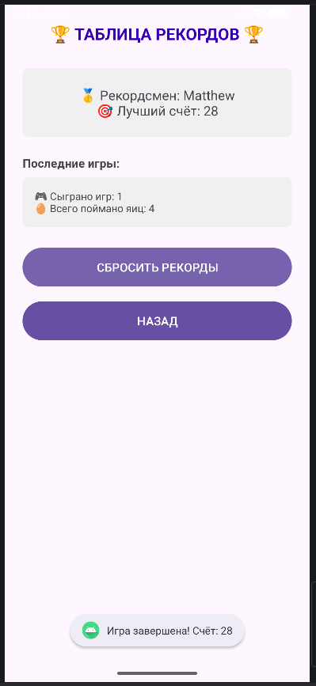

**Рисунок 13** — Экран рекордов с результатами

</div>

#### 6. Дополнительные ресурсы

Для оформления приложения использовано векторное изображение волка и фон для блока настроек.

<div align="center">

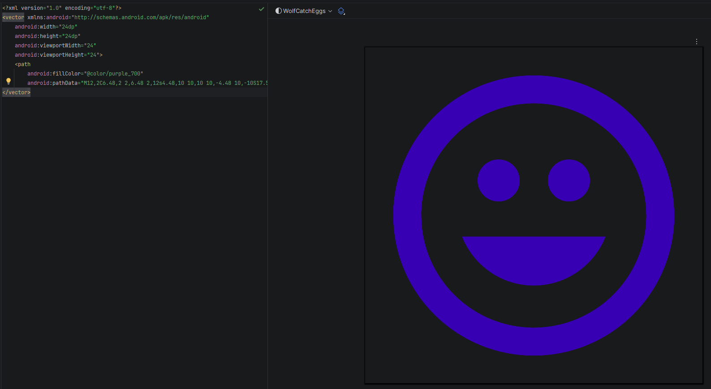

**Рисунок 14** — Векторное изображение ic_wolf.xml

</div>

---

### Вывод

В ходе выполнения практической работы №12 (вариант 11) были изучены шаблоны активностей Android Studio, создано многоэкранное приложение с навигацией, реализовано сохранение настроек и рекордов через `SharedPreferences`. Приложение соответствует всем требованиям варианта: интерфейс не блокируется, настройки сохраняются, рекорды обновляются.

---

### Ответы на контрольные вопросы

**1. Какие шаблоны активностей предоставляет Android Studio? Кратко опишите назначение 3-4 из них.**

- **Empty Activity** — пустая активность с минимальной разметкой. Универсальный шаблон для любых экранов.
- **Basic Activity** — включает `AppBarLayout`, `Toolbar` и `FloatingActionButton`. Подходит для приложений с верхней панелью и плавающей кнопкой.
- **Settings Activity** — генерирует экран настроек на основе `PreferenceFragmentCompat`. Автоматически сохраняет значения в `SharedPreferences`.
- **Navigation Drawer Activity** — создает активность с боковым выдвижным меню (Navigation Drawer).

**2. Для чего используется SharedPreferences? Какие типы данных можно в нём хранить?**

`SharedPreferences` используется для хранения небольших объемов данных в виде пар «ключ-значение». Поддерживаемые типы: `String`, `Int`, `Long`, `Float`, `Boolean`, `Set<String>`.

**3. В чём разница между методами getPreferences(), getSharedPreferences() и PreferenceManager.getDefaultSharedPreferences()?**

- `getPreferences(MODE)` — возвращает настройки, доступные только в рамках текущей активности (имя файла = имя класса).
- `getSharedPreferences(NAME, MODE)` — возвращает настройки с указанным именем, доступные из любой активности.
- `PreferenceManager.getDefaultSharedPreferences(Context)` — возвращает настройки по умолчанию для всего приложения (используется с `Settings Activity`).

**4. Как записать данные в SharedPreferences? Объясните разницу между apply() и commit().**

```kotlin
prefs.edit().putString("key", "value").apply()
```
- `apply()` — асинхронная запись, не возвращает результат, рекомендуется для UI-потока.
- `commit()` — синхронная запись, возвращает `Boolean` (успех/неудача), может блокировать поток.

**5. Как прочитать данные из SharedPreferences? Для чего нужно значение по умолчанию?**

```kotlin
val value = prefs.getString("key", "значение по умолчанию")
```
Значение по умолчанию возвращается, если ключ не найден в хранилище. Это предотвращает ошибки `null` и обеспечивает корректную работу при первом запуске.

**6. Как создать экран настроек с использованием шаблона Settings Activity? Где описываются элементы настроек?**

При создании активности выбирается шаблон **Settings Activity**. Элементы настроек описываются в XML-файле, который находится в папке `res/xml/` (например, `root_preferences.xml`). Для каждого элемента указывается ключ (`key`), заголовок, значение по умолчанию и другие атрибуты.

**7. Как организовать переход между активностями с помощью Intent?**

```kotlin
val intent = Intent(this, TargetActivity::class.java)
startActivity(intent)
```
Для возврата на предыдущий экран используется `finish()` или кнопка «Назад» в Action Bar.

**8. Что такое FloatingActionButton и в каких шаблонах он присутствует?**

`FloatingActionButton` (FAB) — круглая кнопка, расположенная над содержимым экрана, обычно в правом нижнем углу. Используется для основного действия на экране. Присутствует в шаблонах **Basic Activity** и **Scrolling Activity**.


---
---
---
---
---

<div align="center">

# Отчет

</div>

<div align="center">

## Практическая работа №13

</div>

<div align="center">

## Обработка жестов

</div>

**Выполнил:**  
Покидов Матвей Юрьевич

**Курс:** 2

**Группа:** ИНС-б-о-24-1

**Направление:** 09.03.02

**Профиль:** Информационные системы и технологии

**Проверил:**  

Потапов Иван Романович

---

### Цель работы

Изучить механизмы обработки сенсорных событий в Android. Научиться распознавать простые касания и сложные жесты с помощью `MotionEvent` и `GestureDetector`. Интегрировать управление жестами в существующее игровое приложение «Волк ловит яйца».

---

### Ход работы

### Задания для самостоятельного выполнения (вариант 11: Волк ловит яйца)

В рамках выполнения практической работы №13 была произведена интеграция обработки жестов в существующее игровое приложение «Волк ловит яйца», разработанное в ходе практической работы №12.

#### Часть 1. Интеграция в игровое приложение

Был создан универсальный класс `OnSwipeTouchListener`, использующий `GestureDetector` для распознавания жестов. В игровую активность `GameActivity` добавлена поддержка управления игровыми объектами с помощью жестов.

<div align="center">

.png)

**Рисунок 1** — Разметка игрового экрана с игровым полем и объектами

</div>

На главном экране приложения добавлено отображение текущих настроек, включая состояние управления жестами, а также подсказки по использованию жестов в игре.

<div align="center">

.png)

**Рисунок 2** — Главный экран с отображением настроек и подсказками по жестам

</div>

В файл настроек `root_preferences.xml` добавлен переключатель «Управление жестами», позволяющий включать или отключать жестовое управление.

<div align="center">

.png)

**Рисунок 3** — Файл root_preferences.xml с настройкой управления жестами

</div>

#### Часть 2. Дополнительные жесты

С помощью `GestureDetector` реализовано распознавание дополнительных жестов:

**1. Долгое нажатие (onLongPress)**
При долгом нажатии на игровое поле вызывается контекстное меню с опциями «Новая игра» и «Выход».

<div align="center">

.png)

**Рисунок 4** — Контекстное меню, вызванное долгим нажатием

</div>

**2. Двойное касание (onDoubleTap)**
Двойное касание сбрасывает позицию волка в центр игрового поля с анимацией пульсации.

**3. Прокрутка (onScroll)**
Перемещение пальца по игровому полю плавно двигает волка в соответствующем направлении.

В файле `MainActivity.kt` реализован метод `updateSettingsDisplay()`, который отображает текущие настройки и подсказки по управлению жестами.

<div align="center">

.png)

**Рисунок 5** — Метод обновления отображения настроек в MainActivity

</div>

#### Часть 3. Визуальная обратная связь

Для обеспечения понятной обратной связи при выполнении жестов реализованы следующие анимации и эффекты:

- **Анимация нажатия** — при касании игрового поля волк увеличивается в размере, а фон поля меняет цвет.
- **Пульсация волка** — при двойном касании волк пульсирует, подтверждая сброс позиции.
- **Всплывающая подсказка** — в центре экрана появляется эмодзи, соответствующий распознанному жесту.
- **Анимация контекстного меню** — меню плавно появляется и исчезает.
- **Анимация яйца** — при поимке яйцо увеличивается и исчезает.

<div align="center">

.png)

**Рисунок 6** — Успешная ловля яйца свайпом вверх

</div>

<div align="center">

.png)

**Рисунок 7** — Результат свайпа вверх: яйцо поймано, очки начислены

</div>

#### Дополнительные ресурсы

Для визуального оформления игры созданы векторные изображения волка и яйца, а также фон для игрового поля и контекстного меню.

<div align="center">

.png)

**Рисунок 8** — Векторное изображение яйца (ic_egg.xml)

</div>

---

### Вывод

В ходе выполнения практической работы №13 (самостоятельное задание, вариант 11):

1. **Изучены механизмы обработки сенсорных событий в Android:**
   - Класс `MotionEvent` и его основные действия (`ACTION_DOWN`, `ACTION_MOVE`, `ACTION_UP`).
   - Класс `GestureDetector` для распознавания сложных жестов.

2. **Реализована интеграция жестов в игровое приложение:**
   - Управление волком с помощью свайпов и прокрутки.
   - Ловля яйца свайпом вверх или касанием.

3. **Реализованы дополнительные жесты:**
   - Долгое нажатие (`onLongPress`) — вызов контекстного меню.
   - Двойное касание (`onDoubleTap`) — сброс волка в центр.
   - Прокрутка (`onScroll`) — плавное перемещение волка.

4. **Добавлена визуальная обратная связь:**
   - Анимации нажатия, пульсации, перемещения.
   - Всплывающие подсказки с эмодзи жестов.
   - Анимация появления контекстного меню.

5. **Настроена гибкая система управления:**
   - Возможность включения/выключения жестов через настройки.
   - Отображение подсказок по управлению на главном экране.

---

### Ответы на контрольные вопросы

**1. Что такое MotionEvent? Какие основные типы событий (actions) в нём существуют?**

**MotionEvent** — это объект, который содержит информацию о сенсорных событиях (касаниях экрана). Он описывает действия пользователя: координаты касания, давление, размер области касания, время события и т.д.

**Основные типы событий (actions):**

| Константа | Описание |
|-----------|----------|
| `ACTION_DOWN` | Палец коснулся экрана (начало жеста). |
| `ACTION_MOVE` | Палец перемещается по экрану. |
| `ACTION_UP` | Палец поднят с экрана (конец жеста). |
| `ACTION_CANCEL` | Жест прерван системой (например, пришло уведомление). |
| `ACTION_POINTER_DOWN` | Дополнительный палец коснулся экрана (мультитач). |
| `ACTION_POINTER_UP` | Дополнительный палец поднят с экрана. |
| `ACTION_OUTSIDE` | Касание произошло за пределами View. |

---

**2. Для чего используется класс GestureDetector? В чём его преимущество перед обработкой сырых MotionEvent?**

**GestureDetector** — вспомогательный класс для распознавания распространённых жестов (касание, двойное касание, свайп, длительное нажатие, прокрутка).

**Преимущества перед обработкой сырых MotionEvent:**

| Критерий | Обработка MotionEvent вручную | Использование GestureDetector |
|----------|-------------------------------|-------------------------------|
| **Сложность кода** | Нужно вручную отслеживать координаты, время, скорость движения. | Готовые колбэки для каждого жеста. |
| **Распознавание жестов** | Требуется писать сложную математику (расчёт скорости, порогов). | Встроенные алгоритмы распознавания. |
| **Обработка двойного касания** | Нужно отслеживать временные интервалы между `ACTION_DOWN`. | Готовый метод `onDoubleTap()`. |
| **Поддержка мультитач** | Сложная ручная обработка `ACTION_POINTER_DOWN/UP`. | Частично поддерживается через `ScaleGestureDetector`. |
| **Надёжность** | Легко допустить ошибку в расчётах. | Проверенные алгоритмы от Google. |

---

**3. Какой метод GestureDetector отвечает за распознавание быстрого смахивания (свайпа)? Какие параметры он принимает?**

За распознавание свайпа (fling) отвечает метод **`onFling()`** интерфейса `GestureDetector.OnGestureListener`.

**Параметры:**
| Параметр | Описание |
|----------|----------|
| `e1` | Начальное событие касания (`ACTION_DOWN`). Может быть `null` в редких случаях. |
| `e2` | Событие движения (`ACTION_MOVE`), которое привело к распознаванию свайпа. |
| `velocityX` | Скорость движения по горизонтали (пикселей в секунду). Положительное — вправо, отрицательное — влево. |
| `velocityY` | Скорость движения по вертикали (пикселей в секунду). Положительное — вниз, отрицательное — вверх. |

**Возвращаемое значение:** `true` — свайп обработан, `false` — не обработан.

---

**4. Зачем в методе onDown() необходимо возвращать true?**

Метод **`onDown()`** вызывается при событии `ACTION_DOWN` (палец коснулся экрана).

**Возврат `true` в `onDown()` обязателен, потому что:**
- Это **сигнал системе**, что данный жест **должен отслеживаться дальше**.
- Если вернуть `false`, система **прекратит передачу последующих событий** (`onScroll`, `onFling`, `onLongPress`) этому `GestureDetector`.

**Последствия возврата `false`:**
- Не будут вызваны методы `onScroll()`, `onFling()`, `onLongPress()`.
- Жест не будет распознан как длинное нажатие или свайп.

---

**5. Как отличить горизонтальный свайп от вертикального? Какие параметры для этого используются?**

Для определения направления свайпа используются:
1. **Разница координат** между начальным (`e1`) и конечным (`e2`) событиями.
2. **Скорость движения** (`velocityX`, `velocityY`) в методе `onFling()`.

**Способ 1: По разнице координат (в `onScroll` или `onFling`):**

**Способ 2: По скорости (более надёжный):**

---

**6. Что такое пороговые значения (threshold) и зачем они нужны при распознавании жестов?**

**Пороговые значения (threshold)** — это минимальные величины (расстояние, скорость, время), которые должны быть превышены, чтобы жест был распознан.

**Зачем нужны:**
- **Отсеивание случайных микродвижений** (дрожание пальца).
- **Различение жестов** (например, касание vs длительное нажатие).
- **Предотвращение ложных срабатываний**.

**Основные пороговые значения в Android:**

| Параметр | Значение по умолчанию | Назначение |
|----------|----------------------|------------|
| `touchSlop` | ~8dp (зависит от устройства) | Минимальное расстояние для распознавания скролла/свайпа. |
| `minimumFlingVelocity` | ~50 dp/сек | Минимальная скорость для распознавания fling. |
| `maximumFlingVelocity` | ~8000 dp/сек | Максимальная скорость fling. |
| `longPressTimeout` | ~500 мс | Время для распознавания длительного нажатия. |
| `doubleTapTimeout` | ~300 мс | Максимальный интервал между касаниями для двойного тапа. |

---

**7. Как заставить View реагировать на сенсорные события? Какой слушатель для этого используется?**

Для обработки сенсорных событий View используется слушатель **`OnTouchListener`**.

**Способы назначения:**

**Способ 1: Установка слушателя в коде:**

**Способ 2: Переопределение метода в кастомной View:**

**Важно:** Для Accessibility рекомендуется вызывать `performClick()` при обработке касаний.

---

**8. Какие ещё жесты можно распознать с помощью GestureDetector? Назовите не менее трёх.**

`GestureDetector` предоставляет следующие готовые методы для распознавания жестов:

| Жест | Метод | Описание |
|------|-------|----------|
| **Одиночное касание** | `onSingleTapUp()` | Палец поднят сразу после касания (без движения). |
| **Подтверждённое одиночное касание** | `onSingleTapConfirmed()` | Гарантированно одиночное касание (не часть двойного). |
| **Двойное касание** | `onDoubleTap()` | Два быстрых касания подряд. |
| **Двойное касание с движением** | `onDoubleTapEvent()` | События между двойным касанием (DOWN, MOVE, UP). |
| **Длительное нажатие** | `onLongPress()` | Палец удерживается на экране без движения. |
| **Прокрутка (скролл)** | `onScroll()` | Палец движется по экрану с начала жеста. |
| **Быстрое смахивание (свайп)** | `onFling()` | Быстрое движение пальца с отрывом от экрана. |
| **Начало жеста** | `onDown()` | Палец коснулся экрана (первое событие). |
| **Показ нажатия** | `onShowPress()` | Палец коснулся экрана, ещё не двигался и не отпущен. |

**Дополнительно через `ScaleGestureDetector`:**
- **Масштабирование (pinch)** — `onScale()`
- **Начало масштабирования** — `onScaleBegin()`
- **Конец масштабирования** — `onScaleEnd()`

